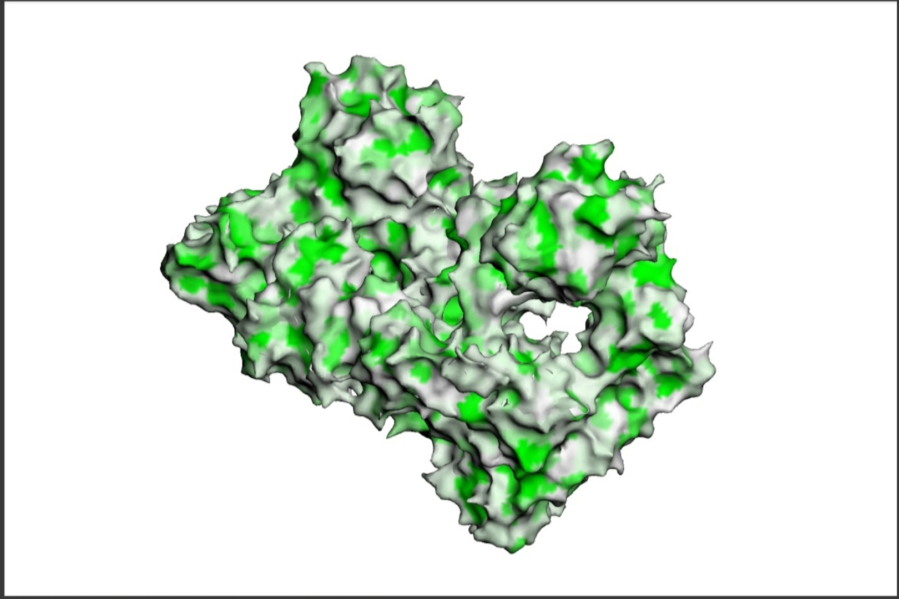
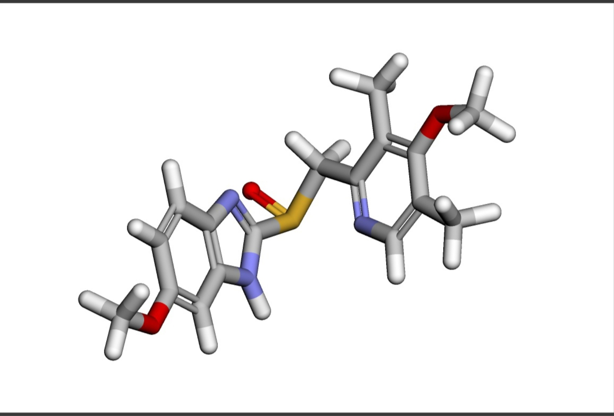
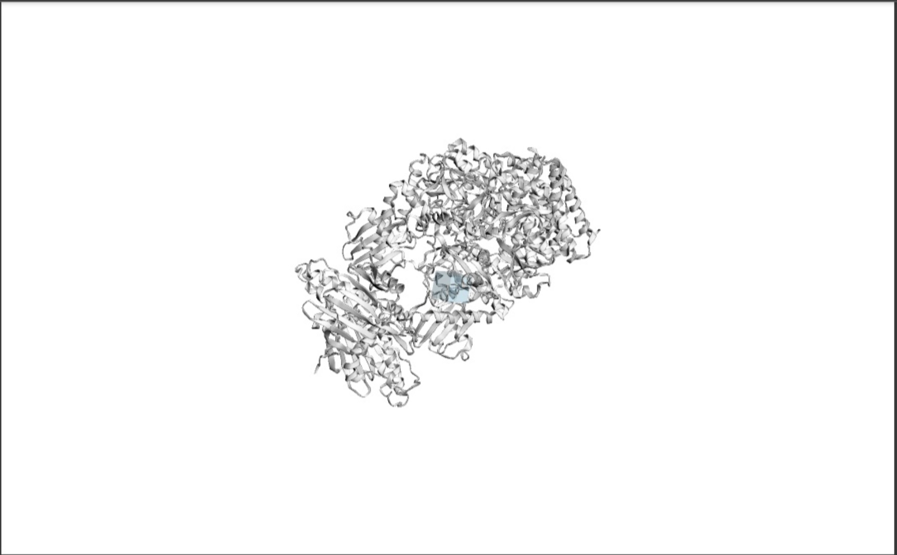
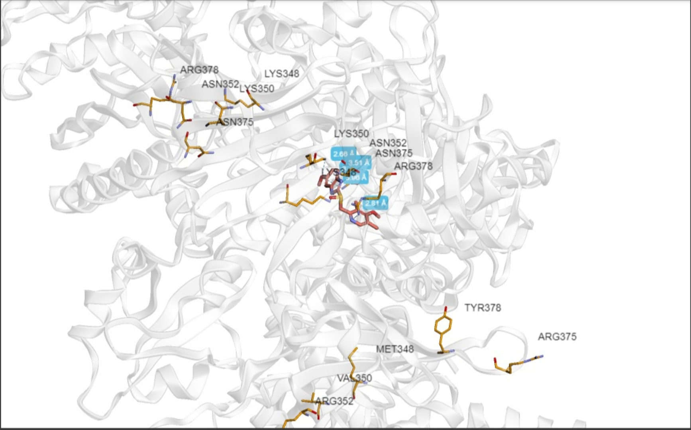

# Задание 6

#### Лекарственное средство: Омепразол

Омепразол относится к классу препаратов, называемых протонной помпы ингибиторами. Его основное действующее вещество также называется омепразолом. 

Омепразол применяется для лечения различных состояний, связанных с избыточной кислотностью в желудке. Он часто используется для лечения язв желудка и двенадцатиперстной кишки, эзофагита (воспаления пищевода), синдрома избыточной секреции желудочного сока и гастроэзофагеальной рефлюксной болезни. Омепразол также может быть включен в комбинированную терапию для уничтожения бактерии Helicobacter pylori, которая является одной из причин язвенной болезни.

Омепразол действует, ингибируя фермент, известный как протонная помпа, который отвечает за выработку кислоты в желудке. Он связывается с белками H+/K+-ATPазами на поверхности париетальных клеток слизистой оболочки желудка, что приводит к блокировке выработки кислоты, снижает кислотность в желудке и способствует заживлению язв и снижению симптомов связанных с избыточной кислотностью.

#### Копия ноутбука с вычислениями:
[basic molecular docking](./Копия_блокнота__basic_molecular_docking.ipynb)

Лучше всего получилось выполнить докинг позиции 1:
[PDB-файл докинга позиции 1](./4279_1_cmpx.pdb)

#### Таргет
[Hsp90-XAP2-AHR cytosolic complex](https://www.rcsb.org/structure/7ZUB)



#### Лиганд 
[Omeprazole](https://www.rcsb.org/ligand/1C6)

SMILES:
```
COC1=CC2=C(C=C1)N=C(N2)S(=O)CC1=NC=C(C)C(OC)=C1C
```



#### Полученный бокс



#### Полученный докинг
 



